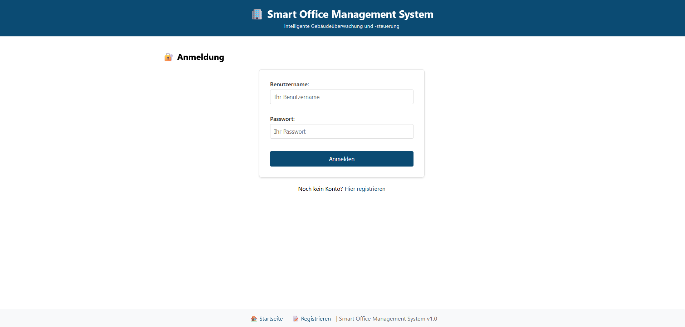
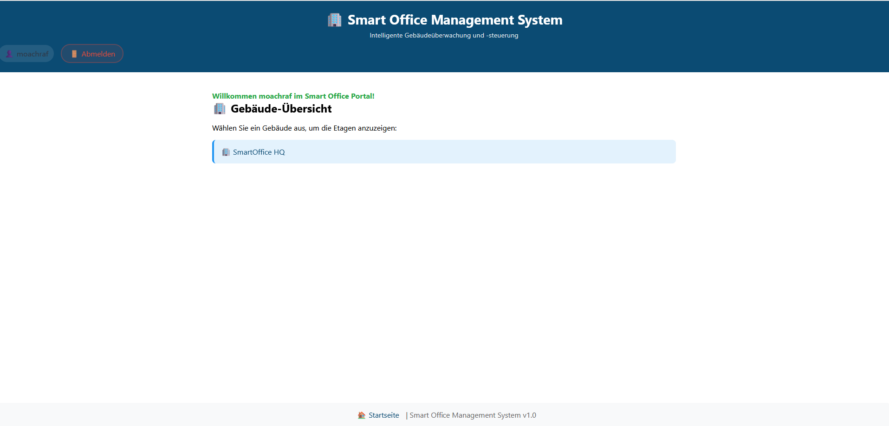
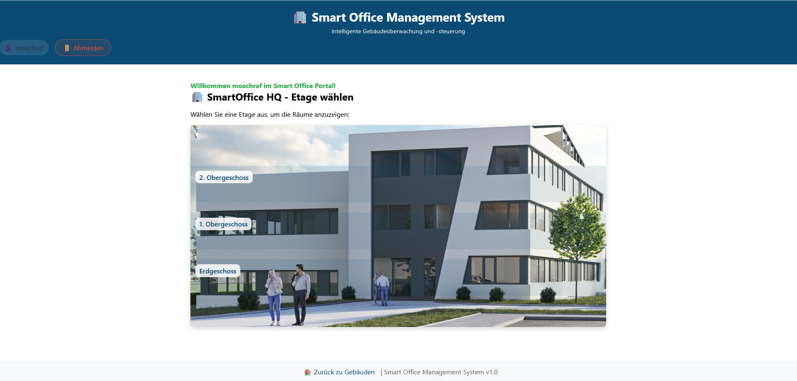
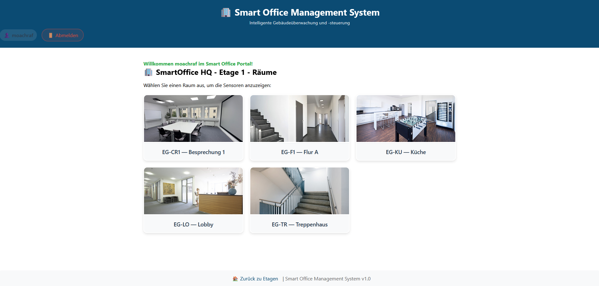
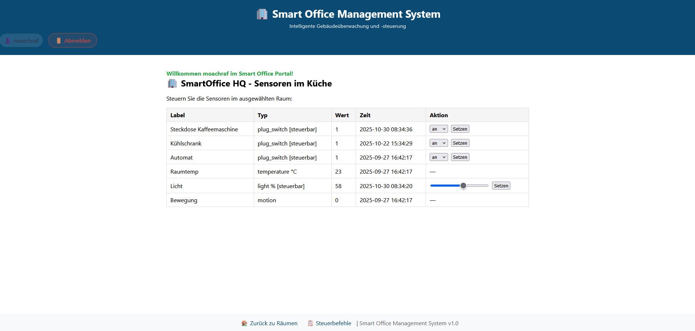
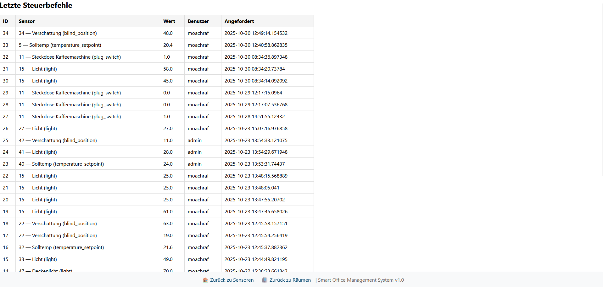

# 🏢 Smart Office Management System

[](https://www.java.com/)
[](https://www.oracle.com/java/technologies/jspt.html)
[](https://www.postgresql.org/)
[](https://developer.mozilla.org/en-US/docs/Web/CSS)
[](https://developer.mozilla.org/en-US/docs/Web/JavaScript)

Ein vollständiges Web-basiertes Management-System für intelligente Gebäudeüberwachung und -steuerung. Dieses System ermöglicht es Benutzern, Gebäude, Etagen, Räume und Sensoren zu verwalten und in Echtzeit zu steuern.

## 📋 Inhaltsverzeichnis

- [Features](#-features)
- [Technologien](#-technologien)
- [Projektstruktur](#-projektstruktur)
- [Installation](#-installation)
- [Verwendung](#-verwendung)
- [Datenbank-Architektur](#-datenbank-architektur)
- [Screenshots](#-screenshots)
- [Zukünftige Erweiterungen](#-zukünftige-erweiterungen)

## ✨ Features

### 🔐 Benutzer-Management
- **Registrierung & Authentifizierung**: Sichere Benutzerregistrierung mit E-Mail-Validierung
- **Session-Management**: Zentrale Session-Verwaltung für Navigation und Benutzerzustand
- **Fehlerbehandlung**: Benutzerfreundliche Fehlermeldungen mit visueller Darstellung

### 🏗️ Gebäude-Verwaltung
- **Mehrstufige Navigation**: Gebäude → Etagen → Räume → Sensoren
- **Visuelle Gebäude-Ansicht**: Interaktive Hotspots für intuitive Navigation
- **Dynamische HTML-Generierung**: Responsive Darstellung aller Gebäudestrukturen

### 📊 Sensoren-Steuerung
- **Echtzeit-Monitoring**: Live-Anzeige aller Sensordaten mit Zeitstempel
- **Mehrere Sensortypen**: 
  - Temperatursensoren (nur lesbar)
  - Licht-Steuerung (0-100%)
  - Jalousien (0-100%)
  - Steckdosen (an/aus)
- **Live-Updates**: Automatische Seitenaktualisierung alle 10 Sekunden
- **Instant-Feedback**: Popup-Benachrichtigungen bei Wertänderungen

### 📋 Audit-Trail
- **Steuerbefehle-Historie**: Vollständige Protokollierung aller Benutzer-Aktionen
- **Nachverfolgbarkeit**: Wer hat welche Sensoren wann geändert

## 🛠️ Technologien

### Backend
- **Java**: Objektorientierte Programmierung
- **JSP (JavaServer Pages)**: Serverseitige Template-Engine
- **JavaBeans**: Datenmodelle und Business-Logik
- **DAO-Pattern**: Datenzugriffsschicht

### Frontend
- **HTML5**: Semantische Markup-Sprache
- **CSS3**: Responsive Design und moderne Styling
- **JavaScript**: Clientseitige Interaktivität und Auto-Refresh

### Datenbank
- **PostgreSQL**: Relationale Datenbank
- **JDBC**: Datenbankverbindungen

### Architektur-Pattern
- **MVC (Model-View-Controller)**: 
  - Model: Beans und DAOs
  - View: JSP-Dateien
  - Controller: Appl-JSP-Dateien
- **Session-Scope Beans**: Zustandsverwaltung über Sessions

## 📁 Projektstruktur

```
BWI520/
├── src/
│   ├── main/
│   │   ├── java/
│   │   │   └── de/hwg_lu/bwi520/
│   │   │       ├── beans/          # JavaBeans für Datenmodelle
│   │   │       │   ├── SmartOfficeBean.java    # Haupt-Controller
│   │   │       │   ├── BuildingBean.java      # Gebäude-Verwaltung
│   │   │       │   ├── RoomBean.java          # Raum-Verwaltung
│   │   │       │   ├── SensorRow.java         # Sensor-Datenmodell
│   │   │       │   └── ...
│   │   │       ├── classes/       # DAO-Klassen (Data Access Object)
│   │   │       │   ├── BuildingDao.java
│   │   │       │   ├── RoomDao.java
│   │   │       │   ├── SensorDao.java
│   │   │       │   └── UserDao.java
│   │   │       └── jdbc/           # Datenbankverbindungen
│   │   │           ├── JDBCAccess.java
│   │   │           └── PostgreSQLAccess.java
│   │   └── webapp/
│   │       ├── css/                # Stylesheets
│   │       ├── js/                 # JavaScript-Dateien
│   │       ├── img/                # Bilder und Assets
│   │       └── jsp/                # JSP-Dateien
│   │           ├── *View.jsp       # View-Dateien (Darstellung)
│   │           └── *Appl.jsp       # Controller-Dateien (Logik)
└── build/                          # Kompilierte Klassen
```

## 🚀 Installation

### Voraussetzungen
- Java JDK 8 oder höher
- Apache Tomcat oder ähnlicher Servlet-Container
- PostgreSQL Datenbank

### Setup-Schritte

1. **Repository klonen**
```bash
git clone https://github.com/MOachrafBA/smart-office-management-system.git
cd smart-office-management-system
```

2. **Datenbank einrichten**
```sql
-- PostgreSQL-Datenbank erstellen
CREATE DATABASE smartoffice;

-- Tabellen erstellen, AppAdminSmartOffice ausführen
```

3. **Datenbankverbindung konfigurieren**
```java
// src/main/java/de/hwg_lu/bwi520/jdbc/PostgreSQLAccess.java
// Datenbankverbindungsdetails anpassen
```

4. **Projekt kompilieren**
```bash
# Eclipse: Rechtsklick auf Projekt → Build Project
```

5. **Auf Tomcat deployen**
```bash
# WAR-Datei erstellen und auf Tomcat deployen
# Oder direkt in Eclipse: Run on Server
```

## 💻 Verwendung

### Workflow

1. **Registrierung**: Neuer Benutzer registriert sich mit E-Mail und Passwort
2. **Anmeldung**: Benutzer meldet sich an (Session wird erstellt)
3. **Gebäude-Auswahl**: Benutzer wählt ein Gebäude aus der Liste
4. **Etagen-Navigation**: Benutzer klickt auf Hotspot im Gebäude-Bild
5. **Raum-Auswahl**: Benutzer wählt einen Raum aus der Kartenansicht
6. **Sensoren-Steuerung**: 
   - Sensoren werden für den Raum angezeigt
   - Benutzer kann steuerbare Sensoren ändern
   - Live-Updates alle 10 Sekunden
   - Popup-Bestätigung bei Änderungen

### Beispiel-Interaktion

```java
// Sensoren für aktuellen Raum laden
List<SensorRow> sensors = mySmartOffice.getSensorsForCurrentRoom();

// Sensor-Wert setzen
mySmartOffice.setSensorValue(sensorId, 80.0);
```

## 🗄️ Datenbank-Architektur

### Tabellen-Struktur

```
building (1) ←→ (N) floor (1) ←→ (N) room (1) ←→ (N) sensor
                                                      ↓
                                               sensor_type (1) ←→ (N) sensor
                                                      ↓
                                               sensor_value (N) ←→ (1) sensor
```

### Haupttabellen

- **building**: Gebäude-Informationen
- **floor**: Etagen mit building_id (Foreign Key)
- **room**: Räume mit floor_id und room_code
- **sensor**: Sensoren mit room_id und type_id
- **sensor_type**: Sensortyp-Definitionen (temperature, light, etc.)
- **sensor_value**: Historische Sensorwerte mit Zeitstempel
- **user**: Benutzer-Accounts
- **control_request**: Protokollierte Steuerbefehle

### Wichtige SQL-Abfragen

```sql
-- Sensoren für einen Raum laden
SELECT s.id, s.label, st.key, st.unit, st.writable,
       COALESCE(sv.value_numeric::text, sv.value_text) AS val,
       to_char(sv.ts,'YYYY-MM-DD HH24:MI:SS') AS ts
FROM sensor s
JOIN sensor_type st ON st.id = s.type_id
LEFT JOIN LATERAL (
  SELECT value_numeric, value_text, ts
  FROM sensor_value v WHERE v.sensor_id = s.id
  ORDER BY ts DESC LIMIT 1
) sv ON TRUE
WHERE s.room_id = ?
ORDER BY s.id;
```

## 📸 Screenshots


### Login & Authentifizierung

*Login-Seite mit E-Mail-Validierung und Fehlerbehandlung*

### Gebäude-Verwaltung

*Übersicht aller verfügbaren Gebäude*


*Interaktive Gebäude-Ansicht mit Hotspots für Etagen-Auswahl*

### Raum-Verwaltung

*Kartenansicht der Räume mit Hover-Effekten*

### Sensoren-Steuerung

*Live-Monitoring und Steuerung von Sensoren mit automatischen Updates*

### Audit-Trail

*Vollständige Protokollierung aller Benutzer-Aktionen*

## 🔮 Zukünftige Erweiterungen

### Geplante Features

- ✅ **Benutzer-Rollen**: Admin, Manager, User mit unterschiedlichen Berechtigungen
- ✅ **IoT-Integration**: Echte Hardware-Sensoren über MQTT/WebSocket
- ✅ **Datenanalyse**: Energieverbrauch-Analyse und Effizienz-Optimierung
- ✅ **Alarmsystem**: Benachrichtigungen bei kritischen Werten (Überstrom, CO2)
- ✅ **Admin-Panel**: GUI für Gebäude/Räume/Sensoren-Verwaltung
- ✅ **Multi-Tenant**: Unterstützung für mehrere Organisationen

## 👨‍💻 Autor

**Mohamed Achraf Badaoui**

- GitHub: [@MOachrafBA](https://github.com/MOachrafBA)
- LinkedIn: [Mohamed Achraf Badaoui](linkedin.com/in/achraf-badaoui-1a7990302)

## 📝 Lizenz

Dieses Projekt wurde als Studienarbeit entwickelt.

## 🙏 Danksagungen

- Professor und Kommilitonen für Feedback während der Präsentation
- Java JSP Community für Best Practices

---

⭐ Wenn Ihnen dieses Projekt gefällt, geben Sie bitte einen Star!

